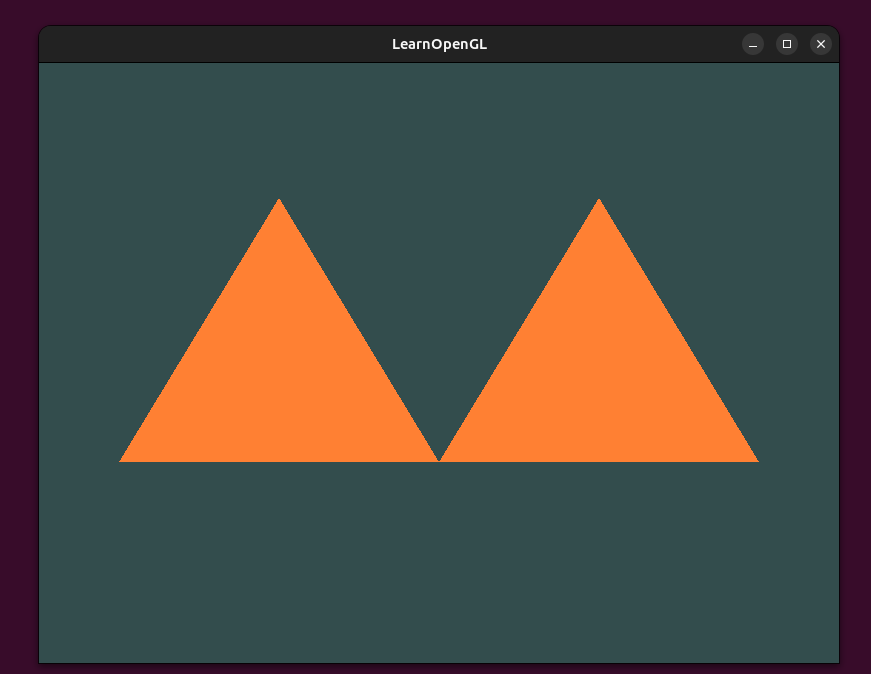

# This repo follows the LearnOpenGL.com tutorial and all the credit goes to Joey de Vries

# Steps to create Linux OpenGL starter project

1) Install prerequisite GLFW libraries and runtimes from the command prompt
```bash
sudo apt install libglfw3 libglfw3-dev libgl1-mesa-dev libx11-dev
```
2) Set up GLAD using the open source web service using GLAD1 version and make sure the language is set to C++, and in the API section select an OpenGL version of at least 3.3. Also make sure the profile is set to Core and that the Generate a loader option is ticked. Ignore the extensions and click Generate to produce the resulting library files.

3) Clone this repo and use the Makefile to compile, clean, and run the code to your hearts content. Feel free to modify, contribute, expand and experiment as much as you'd like.
    1) Compile code : ``` make ```
    2) Run compiled code : ``` make run ```
    3) Clean and erase binaries : ``` make clean ```


# Vim is used as a C++ OpenGL IDE by configuring a few settings and adding a few plugins outlined below : 


## Vim plugins used with "vim-plug" plugin manager : 

1) **Conquer of Completion** (coc.nvim) used in conjuction with clangd for autocomplete, linting, jump to definitions, LSP engine etc...
2) **NERDTree** (preservim/nerdtree) file system explorer.
3) **Fuzzy File Finder** (junegunn/fzf) for efficient file searching.

## Configuring ``` .vimrc ``` for C++ IDE OpenGL development : 
1) A copy of my ``` .vimrc ``` will be provided as a reference for key remaps and settings used.

## Add the C/C++ extension for coc:
```ruby
:CocInstall coc-clangd coc-cmake coc-json 
```

## Create ``` ~/.vim/coc-settings.json ``` :
```json
{
  "clangd.arguments": [
    "--background-index",
    "--clang-tidy",           // enable linting
    "--all-scopes-completion",
    "--header-insertion=never"
  ],
  "coc.preferences.formatOnSaveFiletypes": false
}
```

## Use bear to feed clangd proper flags (compile_commands.json) : 
1) Install bear with ``` sudo apt install bear ```
2) Generate the database while building ``` bear -- make ```
    - This writes ``` compile_commands.json ``` in the project root which is used by clangd.


# Solutions to end of chapter exercises:

### Exercise 5.1)
**<u>Solution</u>**): Add three more vertices and and adjust vertices to align with each triangle endpoints. Also call ``` glDrawArrays() ``` with a value of `6` instead of `3`.

